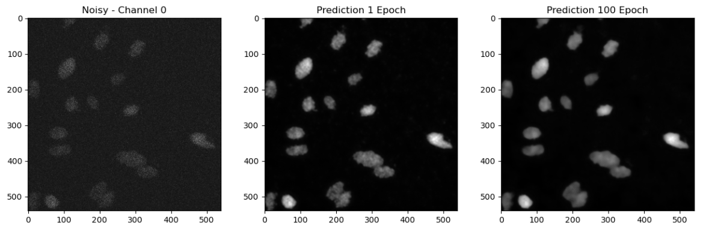
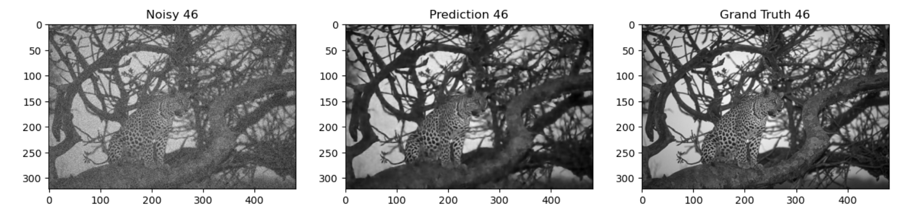

N2V in pratica:
* Grand Challenge: cosa è, perche si usa N2V in questo contesto
* Codice Python
* Risultati con diversi valori per epochs e batch_size
* Difetti del N2V e possibili risoluzioni

# Noise2Void (N2V):


## Grand Challenge
N2V è stato applicato in vari contesti, tra cui il **AI4Life Microscopy Denoising Challenge**, una competizione internazionale mirata al miglioramento delle immagini di microscopia, spesso affette da rumore (strutturato o non strutturato). 

La challenge si concentra sul miglioramento della qualità delle immagini microscopiche biologiche riducendo il rumore senza comprometterne i dettagli o l'integrità visiva. I partecipanti sono invitati a sviluppare e applicare algoritmi avanzati su dataset standardizzati, contenenti immagini provenienti da diverse sorgenti biologiche. 
Ogni dataset include un riferimento (ground truth) per consentire una valutazione oggettiva dei risultati.
Il metodo si distingue per la capacità di rimuovere il rumore utilizzando immagini rumorose senza necessità di dati puliti per l'addestramento, rendendole adatte a contesti, come questo, dove raccogliere dati di riferimento è difficile o costoso.

### Struttura del challenge
I partecipanti applicano algoritmi su dataset biologici standardizzati.
Le performance degli algoritmi sono valutate attraverso metriche riconosciute, come il **Peak Signal-to-Noise Ratio (PSNR)**, che misura quanto l'immagine denoised si avvicina all'originale in termini di fedeltà, e il **Structural Similarity Index (SSIM)**, che analizza la somiglianza strutturale tra le due immagini.
I risultati dei partecipanti sono poi confrontati con approcci tradizionali e di nuova generazione, consentendo di identificare le soluzioni più efficaci. 

#### PSNR
$$
\text{PSNR} = 10 \cdot \log_{10} \left( \frac{\text{MAX}^2}{\text{MSE}} \right)
$$

* Dove MAX: Rappresenta il valore massimo dell'intensità dei pixel nelle immagini microscopiche.
* MSE (Mean Squared Error): È l'errore quadratico medio tra l'immagine originale (ground truth) e quella denoised.
* Il PSNR si misura in decibel (dB): Valori più alti indicano una migliore qualità dell'immagine denoised (più vicina all'originale). Valori bassi indicano maggiore perdita di qualità.


### Perché usare N2V in questo contesto?
Noise2Void (N2V) è particolarmente adatto per il contesto del challenge per le seguenti ragioni:
1. **Dati rumorosi senza immagini pulite di riferimento**:
    La microscopia biologica spesso produce immagini rumorose e ottenere dati "ground truth" privi di rumore è laborioso, se non impossibile. N2V si addestra direttamente su immagini rumorose, eliminando la necessità di dati puliti.

2.	**Generale adattabilità al rumore**:
    N2V è efficace contro vari tipi di rumore, inclusi rumori indipendenti tra pixel (tipici in dati microscopici non elaborati). Sebbene abbia limitazioni con il rumore strutturato, il suo approccio adattivo è comunque competitivo in scenari misti.

3.	**Conservazione del contenuto biologico**:
    I metodi di denoising tradizionali possono attenuare o distorcere dettagli importanti per l'analisi biologica. N2V è progettato per preservare le caratteristiche strutturali, rendendolo ideale per immagini di cellule, tessuti e altre strutture microscopiche.

## Codice Python
Le implementazioni di Noise2Void (N2V) sono facilmente accessibili attraverso librerie come **CSBDeep**, che sfrutta framework popolari come **TensorFlow** e **Keras**. 
Per addestrare il modello, gli script richiedono di specificare parametri essenziali come il numero di epoche, la dimensione del batch e l'architettura della rete. L'approccio standard utilizza una rete convoluzionale che integra un meccanismo per escludere alcuni pixel durante l'addestramento. Questo processo permette alla rete di sviluppare una notevole capacità di riduzione del rumore, rendendola robusta anche in presenza di dati rumorosi.

#### Immagini di codice:
1. **Create the Training Configuration**:

Prima di procedere all'addestramento della Rete, occorre creare un oggetto di Configurazione dell'addestramento e della Rete che si desidera utilizzare.

I parametri più rilevanti per l'addestramento sono:
* **batch_size**
* **num_epochs**

Aggiustare il valore di questi parametri coerentemente alle caratteristiche dell'hardware su cui si intende svolgere l'addestramento.

```python
config = create_n2v_configuration(
    experiment_name="jump_cells_n2v",
    data_type="array",
    axes="SCYX",
    n_channels=4,
    patch_size=(64, 64),
    batch_size=32,
    num_epochs=1,
    independent_channels=True,
)

print(config)
```

2. **Train the Model**:

L'addestramento del Modello avviene creando un oggetto CAREamist a partire dall'oggetto di Configurazione creato precedentemente.
Il metodo **.train** del Modello richiede semplicemente che vengano fornite le immagini di Training e Validation.

Durante il training è possibile osservare alcuni parametri che ne descrivono l'andamento.

Al termine dell'addestramento vengono salvati gli Stati migliori del Modello in appositi file, segnalati con estensione .ckpt (**Checkpoint**).
```python
# Before proceding, make sure your GPU is available to PyTorch or the training will be very slow

careamist = CAREamist(source=config, work_dir="notebooks/models/jump")

# train model
print(f"Training starting now...")
careamist.train(train_source=train_images, val_source=val_images)
print("Training ended!")
```

3. **Generate Predictions**

Terminato l'addestramento, osserviamo il comportamento del Modello chiedendogli di predire le Immagini Pulite per alcuni campioni rumorosi.
Tipicamente sarebbe più opportuno testare il Modello su dati diversi da quelli con cui viene addestrato, tuttavia nel caso specifico dell'Algoritmo N2V questa precauzione non è necessaria, poiché l'Algoritmo non ha comnuque mai avuto modo di imparare dalle Ground Truth di queste immagini.

Tramite il metodo .predict del Modello utilizziamo l'ultimo Checkpoint disponibile per predirre le prime 10 immagini del Dataset.
Queste immagini vengono opportunamente salvate in memoria, in formato .TIFF.

```python
output_path = "notebooks/predictions/jump/predictions.tiff"
predict_counter = 10 # The number of images we want to predict

predictions = []
for i in range(predict_counter):
    print(f"Predicting batch number {i}")
    pred_batch = careamist.predict(source=train_images[i], data_type='array', axes='CYX')
    predictions.append(pred_batch)

predictions = np.concatenate(predictions, axis=0).squeeze()
os.makedirs(os.path.dirname(output_path), exist_ok=True)
tifffile.imwrite(output_path, predictions)
print(f"TIFF file saved to {output_path}")
```

#### IMMAGINI




## Risultati con valori variabili per epochs e batch_size
Un **numero maggiore di epoch** e consente al modello di convergere meglio, migliorando la sua capacità di adattarsi ai dati. Tuttavia, questo comporta il rischio di sovrallenamento, soprattutto se il modello si adatta troppo ai dettagli specifici del dataset. 
Per quanto riguarda la **dimensione del batch**, utilizzare batch più grandi può velocizzare il processo di addestramento, ma richiede una maggiore quantità di memoria. Valori comuni per il batch size sono 16 o 32. 
L’ottimizzazione di questi parametri, applicata a dataset di microscopia, ha dimostrato di migliorare significativamente metriche come il rapporto segnale-rumore (**PSNR**) e l’indice di somiglianza strutturale (**SSIM**), che misurano la qualità delle immagini denoised rispetto a quelle originali.

++ **IMMAGINI DIFFERENZA TRA EPOCH** 


## Difetti del N2V e possibili risoluzioni 
N2V può introdurre **artefatti** in immagini con dettagli complessi, poiché il suo approccio ignora i pixel vicini durante l'addestramento. Inoltre, non gestisce bene il rumore strutturato, che presenta correlazioni tra i pixel.

Una Possibile risoluzione è l'uso di **Dati sintetici**: Simulare rumore realistico durante l'addestramento aiuta il modello a generalizzare meglio.

### Problema blurry images --> N2V2
N2V soffre inoltre di un problema noto come **blurry images**, ossia la generazione di immagini con un aspetto sfocato. Questo problema viene risolto nella versione successiva, Noise2Void2 (N2V2).

#### Origine del problema
N2V sfrutta il contesto locale di un pixel rumoroso per predirne il valore corretto. Tuttavia, questa strategia implica una perdita di dettagli fini e texture, specialmente quando l'immagine ha strutture complesse o rumore ad alta frequenza.

L'algoritmo:
* Rimuove il pixel bersaglio durante l'addestramento.
* Predice il valore del pixel in base ai pixel circostanti (mascherando il pixel di destinazione).

Questo meccanismo porta a predizioni troppo lisce perché il modello tende a favorire una media dei valori circostanti, risultando in:
* Dettagli attenuati.
* Sfocatura su bordi o texture fini.

#### Soluzione proposta da Noise2Void2 (N2V2)
Noise2Void2 (N2V2) risolve il problema delle *blurry images* migliorando la qualità delle predizioni attraverso:

1. **Predizione probabilistica**: Invece di un valore singolo, stima una distribuzione di probabilità, preservando dettagli e bordi.
2. **Nuova funzione di perdita**: Utilizza una perdita basata su distribuzioni, riducendo l'effetto di sovra-lisciamento.
3. **Mascheramento ottimizzato**: Migliora il contesto locale per predizioni più accurate.
4. **Incorporazione di priori**: Usa conoscenze predefinite per gestire strutture complesse.

Questo rende N2V2 più efficace nel mantenere texture e dettagli rispetto a N2V.


CAREamics noise to void overview https://careamics.github.io/0.1/algorithms/Noise2Void/
++ file:///C:/Users/carlo/Downloads/978-3-031-25069-9.pdf pag 525 

https://ai4life-mdc24.grand-challenge.org/

https://ai4life-mdc24.grand-challenge.org/useful-links/


# Il Rumore
Cos'è il Rumore:  
* Come si forma
* Come si classifica

## 1. **Cos'è il Rumore nelle Immagini**
Il **rumore** nelle immagini è una distorsione casuale che altera i pixel, rendendo l'immagine meno chiara o visibile. 

Esso è un artefatto che non rappresenta informazioni reali e può compromettere l'analisi dei dati. 

Il rumore può distorcere la qualità dell'immagine, influenzando la sua nitidezza, contrasto e dettagli.

## 2. **Come si Forma il Rumore**
Il rumore può formarsi in vari modi durante il processo di acquisizione delle immagini. Alcune cause comuni includono:

- **Rumore da sensore**: Quando i sensori della fotocamera o del microscopio non catturano correttamente tutte le informazioni luminose, producendo distorsioni.
- **Interferenze elettroniche**: Disturbi nei circuiti elettronici che possono alterare i segnali durante la registrazione.
- **Limitazioni hardware**: La qualità dei dispositivi di acquisizione può essere una causa di rumore, soprattutto quando la risoluzione o la sensibilità non sono sufficienti.
- **Condizioni ambientali**: Fluttuazioni di temperatura, illuminazione instabile o vibrazioni possono introdurre rumore nei dati.
- **Compressione dei dati**: Algoritmi di compressione per ridurre la dimensione del file possono introdurre artefatti che appaiono come rumore.

## 3. **Come si Classifica il Rumore**
Esistono diversi tipi di rumore, ognuno con caratteristiche specifiche. I principali sono:

- **Rumore Gaussiano**: È un tipo di rumore che segue una distribuzione normale (gaussiana). È causato da fluttuazioni casuali nei sensori e in generale si distribuisce in modo uniforme in tutta l'immagine. È uno dei tipi di rumore più comuni nelle immagini.
- **Rumore di Poisson**: Tipicamente presente in immagini con scarsa illuminazione, è causato dalle fluttuazioni casuali nel numero di fotoni rilevati dal sensore. Questo tipo di rumore è spesso associato a basse intensità di segnale.
- **Rumore Sale e Pepe**: È caratterizzato da pixel bianchi e neri casuali sparsi nell'immagine. È causato da errori di trasmissione o da difetti nel sensore o nei circuiti elettronici.
- **Rumore Uniforme**: Ha una distribuzione uniforme in tutte le direzioni dell'immagine e può essere causato da disturbi a livello di sensori o compressione dei dati.

## 4. **Implicazioni per il Denoising**
Il denoising, cioè la riduzione del rumore, è cruciale per migliorare la qualità delle immagini, specialmente in ambiti scientifici e medici come la microscopia. 

I metodi di denoising cercano di eliminare il rumore pur mantenendo i dettagli e le caratteristiche importanti dell'immagine.


